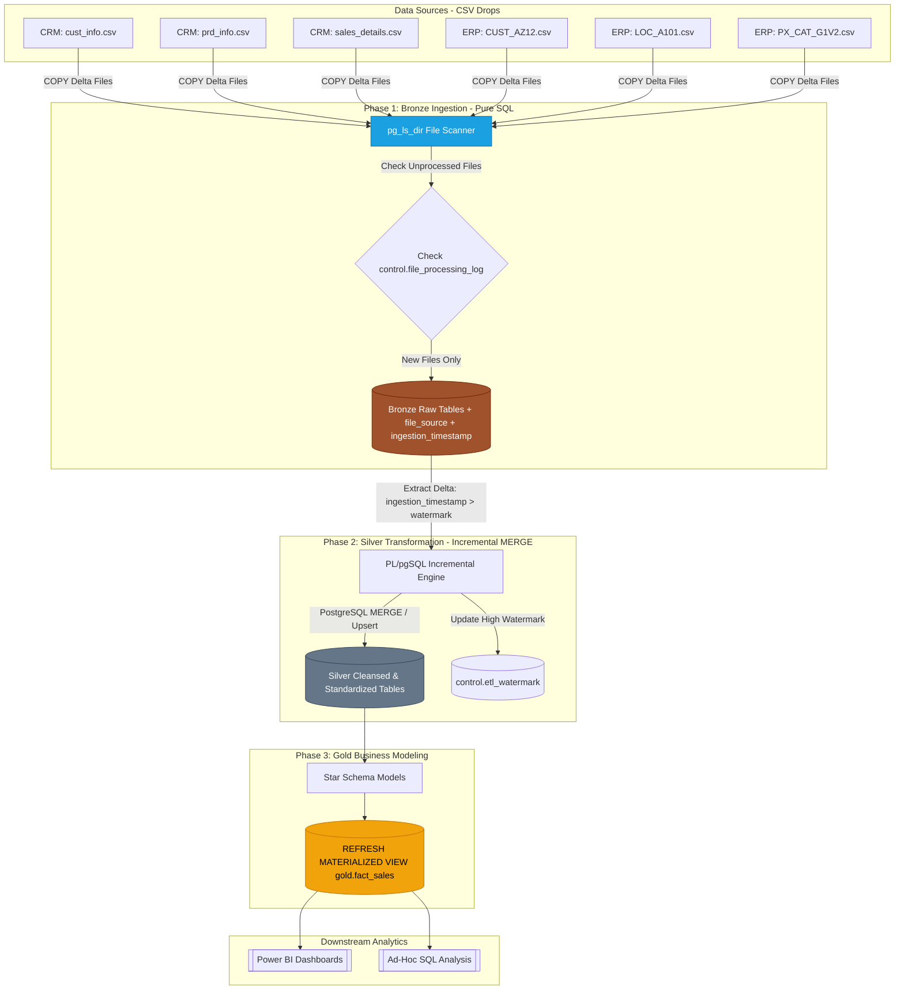

# Enterprise Sales Data Warehouse — Incremental Batch Loading Pipeline

## Overview
This repository contains the advanced data engineering pipeline for the **Enterprise Sales Data Warehouse**, built on a **Medallion Architecture (Bronze, Silver, Gold)** powered by **PostgreSQL**. 

Unlike traditional full-load ETL pipelines that truncate and rebuild tables on every run, this project implements a pure SQL **Incremental Batch Loading Engine**. It utilizes file-level auditing (`pg_ls_dir`), high-watermark tracking (`control.etl_watermark`), and PostgreSQL native `MERGE` statements to process only new or updated records across all **6 source datasets (CRM & ERP)**.

---

## 🏗️ Architecture & Pipeline Flow



---

## Key Features & Improvements Over Full Load

* **Zero Python Dependency**: Ingestion runs 100% inside PostgreSQL using native `pg_ls_dir()` and PL/pgSQL stored procedures.
* **Idempotent Ingestion**: `control.file_processing_log` tracks ingested file names, preventing accidental duplicate imports of the same CSV file.
* **Delta Transformation via High Watermarks**: `control.etl_watermark` tracks the exact timestamp of the last successful transformation run per table.
* **PostgreSQL Native `MERGE`**: Upserts new inserts while updating existing records seamlessly in Silver tables.
* **Optimized Gold Layer**: Materialized Views with concurrent refreshes for lightning-fast analytical queries.

---

## 📊 Source Datasets & Medallion Mapping

The Data Warehouse ingests 6 datasets originating from two independent source systems:

| System | CSV File Name | Bronze Table | Silver Table | Unique Business Key |
| :--- | :--- | :--- | :--- | :--- |
| **CRM** | `cust_info.csv` | `bronze.crm_cust_info` | `silver.crm_cust_info` | `cst_id` |
| **CRM** | `prd_info.csv` | `bronze.crm_prd_info` | `silver.crm_prd_info` | `prd_id` |
| **CRM** | `sales_details.csv` | `bronze.crm_sales_details` | `silver.crm_sales_details` | `sls_ord_num`, `sls_prd_key` |
| **ERP** | `CUST_AZ12.csv` | `bronze.erp_cust_az12` | `silver.erp_cust_az12` | `cid` |
| **ERP** | `LOC_A101.csv` | `bronze.erp_loc_a101` | `silver.erp_loc_a101` | `cid` |
| **ERP** | `PX_CAT_G1V2.csv` | `bronze.erp_px_cat_g1v2` | `silver.erp_px_cat_g1v2` | `id` |

---

## 🛠️ Step-by-Step Setup & Execution

### Step 1: Initialize Database & Control Infrastructure

Create the core `DataWarehouse` database, schemas (`bronze`, `silver`, `gold`, `control`), and control audit tables:

```sql
CREATE DATABASE "DataWarehouse";

CREATE SCHEMA IF NOT EXISTS bronze;
CREATE SCHEMA IF NOT EXISTS silver;
CREATE SCHEMA IF NOT EXISTS gold;
CREATE SCHEMA IF NOT EXISTS control;

-- Tracks processed CSV files
CREATE TABLE control.file_processing_log (
    file_id SERIAL PRIMARY KEY,
    source_system VARCHAR(20) NOT NULL,
    table_name VARCHAR(100) NOT NULL,
    file_name VARCHAR(255) UNIQUE NOT NULL,
    rows_loaded INT,
    loaded_at TIMESTAMP DEFAULT NOW()
);

-- Tracks high watermarks for Silver transformation
CREATE TABLE control.etl_watermark (
    table_name VARCHAR(100) PRIMARY KEY,
    last_loaded_timestamp TIMESTAMP NOT NULL,
    updated_at TIMESTAMP DEFAULT NOW()
);

-- Seed initial watermarks for all 6 tables
INSERT INTO control.etl_watermark (table_name, last_loaded_timestamp)
VALUES 
    ('silver.crm_cust_info', '1900-01-01 00:00:00'),
    ('silver.crm_prd_info', '1900-01-01 00:00:00'),
    ('silver.crm_sales_details', '1900-01-01 00:00:00'),
    ('silver.erp_cust_az12', '1900-01-01 00:00:00'),
    ('silver.erp_loc_a101', '1900-01-01 00:00:00'),
    ('silver.erp_px_cat_g1v2', '1900-01-01 00:00:00');
```

---

### Step 2: Create Bronze Layer Schemas & Stored Procedure

Bronze tables store raw data with two added metadata audit columns: `file_source` and `ingestion_timestamp`.

#### Procedure: `bronze.load_bronze_incremental_all()`
This procedure scans source directories (`C:/datasets/source_crm` and `C:/datasets/source_erp`) using `pg_ls_dir()`, loading only unrecorded CSV drops:

```sql
CREATE OR REPLACE PROCEDURE bronze.load_bronze_incremental_all()
LANGUAGE plpgsql AS $$
DECLARE
    f_rec RECORD;
    v_crm_dir TEXT := 'C:/datasets/source_crm';
    v_erp_dir TEXT := 'C:/datasets/source_erp';
    v_full_path TEXT;
BEGIN
    -- 1. Ingest CRM: cust_info
    FOR f_rec IN SELECT file_name FROM pg_ls_dir(v_crm_dir) WHERE file_name LIKE 'cust_info%.csv' LOOP
        IF NOT EXISTS (SELECT 1 FROM control.file_processing_log WHERE file_name = f_rec.file_name) THEN
            v_full_path := v_crm_dir || '/' || f_rec.file_name;
            CREATE TEMP TABLE temp_cust (LIKE bronze.crm_cust_info EXCLUDING DEFAULTS) ON COMMIT DROP;
            EXECUTE format('COPY temp_cust(cst_id, cst_key, cst_firstname, cst_lastname, cst_material_status, cst_gndr, cst_create_date) FROM %L WITH (FORMAT CSV, HEADER TRUE)', v_full_path);
            
            INSERT INTO bronze.crm_cust_info (cst_id, cst_key, cst_firstname, cst_lastname, cst_material_status, cst_gndr, cst_create_date, file_source, ingestion_timestamp)
            SELECT cst_id, cst_key, cst_firstname, cst_lastname, cst_material_status, cst_gndr, cst_create_date, f_rec.file_name, NOW() FROM temp_cust;
            
            INSERT INTO control.file_processing_log (source_system, table_name, file_name) VALUES ('CRM', 'bronze.crm_cust_info', f_rec.file_name);
        END IF;
    END LOOP;

    -- Repeat process for sales_details, prd_info, CUST_AZ12, LOC_A101, PX_CAT_G1V2...
END;
$$;
```

---

### Step 3: Create Silver Layer Schemas & Incremental MERGE Procedure

Silver tables apply standardization, data cleansing, and null handling.

#### Procedure: `silver.load_silver_all()`
Selects rows from Bronze where `ingestion_timestamp > last_loaded_timestamp`, performs an upsert (`MERGE`), and updates the high watermark:

```sql
CREATE OR REPLACE PROCEDURE silver.load_silver_all()
LANGUAGE plpgsql AS $$
DECLARE
    v_last_wm TIMESTAMP;
    v_new_wm TIMESTAMP := clock_timestamp();
BEGIN
    -- Incremental MERGE for silver.crm_sales_details
    SELECT last_loaded_timestamp INTO v_last_wm FROM control.etl_watermark WHERE table_name = 'silver.crm_sales_details';

    MERGE INTO silver.crm_sales_details target
    USING (
        SELECT 
            sls_ord_num, sls_prd_key, sls_cust_id,
            CASE WHEN sls_order_dt = 0 OR LENGTH(CAST(sls_order_dt AS VARCHAR)) != 8 THEN NULL ELSE TO_DATE(CAST(sls_order_dt AS VARCHAR), 'YYYYMMDD') END AS sls_order_dt,
            CASE WHEN sls_ship_dt = 0 OR LENGTH(CAST(sls_ship_dt AS VARCHAR)) != 8 THEN NULL ELSE TO_DATE(CAST(sls_ship_dt AS VARCHAR), 'YYYYMMDD') END AS sls_ship_dt,
            CASE WHEN sls_due_dt = 0 OR LENGTH(CAST(sls_due_dt AS VARCHAR)) != 8 THEN NULL ELSE TO_DATE(CAST(sls_due_dt AS VARCHAR), 'YYYYMMDD') END AS sls_due_dt,
            CASE WHEN sls_sales IS NULL OR sls_sales <= 0 OR sls_sales != (sls_quantity * ABS(sls_price)) THEN sls_quantity * ABS(sls_price) ELSE sls_sales END AS sls_sales,
            sls_quantity, sls_price
        FROM bronze.crm_sales_details
        WHERE ingestion_timestamp > v_last_wm
    ) source
    ON target.sls_ord_num = source.sls_ord_num AND target.sls_prd_key = source.sls_prd_key
    WHEN MATCHED THEN
        UPDATE SET sls_cust_id = source.sls_cust_id, sls_sales = source.sls_sales, sls_quantity = source.sls_quantity, sls_price = source.sls_price, dwh_create_date = v_new_wm
    WHEN NOT MATCHED THEN
        INSERT (sls_ord_num, sls_prd_key, sls_cust_id, sls_order_dt, sls_ship_dt, sls_due_dt, sls_sales, sls_quantity, sls_price, dwh_create_date)
        VALUES (source.sls_ord_num, source.sls_prd_key, source.sls_cust_id, source.sls_order_dt, source.sls_ship_dt, source.sls_due_dt, source.sls_sales, source.sls_quantity, source.sls_price, v_new_wm);

    UPDATE control.etl_watermark SET last_loaded_timestamp = v_new_wm WHERE table_name = 'silver.crm_sales_details';

    -- Repeat MERGE logic for remaining 5 Silver tables...
END;
$$;
```

---

### Step 4: Materialize Gold Layer

Transform Silver tables into analytical dimensional models and materialize `gold.fact_sales` for optimal reporting performance:

```sql
CREATE MATERIALIZED VIEW gold.fact_sales AS
SELECT
    sd.sls_ord_num AS order_number,
    pr.product_key,
    cu.customer_key,
    sd.sls_order_dt AS order_date,
    sd.sls_ship_dt AS shipping_date,
    sd.sls_due_dt AS due_date,
    sd.sls_sales AS sales_amount,
    sd.sls_quantity AS quantity,
    sd.sls_price AS price
FROM silver.crm_sales_details sd
LEFT JOIN gold.dim_product pr ON sd.sls_prd_key = pr.product_number
LEFT JOIN gold.dim_customers cu ON sd.sls_cust_id = cu.customer_id;

CREATE UNIQUE INDEX idx_fact_sales ON gold.fact_sales(order_number, product_key);
```

---

## 🚀 Execution & Automation

Whenever new CSV batch files arrive in the source directories, run the pipeline with two SQL commands:

```sql
-- 1. Ingest newly dropped CSV files into Bronze
CALL bronze.load_bronze_incremental_all();

-- 2. Process delta records into Silver & update high watermarks
CALL silver.load_silver_all();

-- 3. Refresh Gold Materialized Views
REFRESH MATERIALIZED VIEW CONCURRENTLY gold.fact_sales;
```

---

## 🔍 Verification & Audit Queries

Verify incremental batch execution and watermark status:

```sql
-- Check ingested file logs
SELECT * FROM control.file_processing_log ORDER BY loaded_at DESC;

-- Check high watermarks per table
SELECT * FROM control.etl_watermark;

-- Check total records in Bronze vs Silver
SELECT 
    (SELECT COUNT(*) FROM bronze.crm_sales_details) AS bronze_count,
    (SELECT COUNT(*) FROM silver.crm_sales_details) AS silver_count;
```
